# session-lens architecture

session-lens reads recordings of coding-agent sessions, works out what happened in each one, asks a language model to judge the parts that need judging, and shows the result in a web page. It runs as one program on one machine. This document describes the parts of that program (section 1 to 3), how data is stored (section 4), and how the program behaves while it runs (section 5 to 8).

The diagrams are Mermaid, so GitHub draws them. Where a diagram simplifies, the text under it says what was left out. File paths are relative to `src/session_lens/`.

## 1. System context

A person uses a browser to talk to the program. The program keeps everything it knows in one folder on disk. It talks to a model only if the person chose one, and only the local one by default.

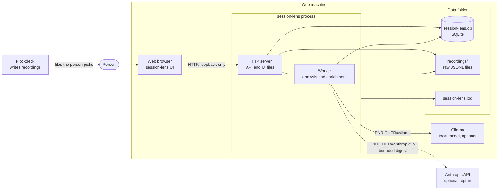
```mermaid
flowchart LR
    person([Person])
    fd[Flockdeck<br/>writes recordings]
    subgraph machine[One machine]
        browser[Web browser<br/>session-lens UI]
        subgraph proc[session-lens process]
            server[HTTP server<br/>API and UI files]
            worker[Worker<br/>analysis and enrichment]
            server --- worker
        end
        subgraph data[Data folder]
            db[(session-lens.db<br/>SQLite)]
            raw[recordings/<br/>raw JSONL files]
            log[session-lens.log]
        end
        ollama[Ollama<br/>local model, optional]
    end
    anthropic[Anthropic API<br/>optional, opt-in]

    fd -. files the person picks .-> person
    person --> browser
    browser -- "HTTP, loopback only" --> server
    server --> db
    server --> raw
    worker --> db
    worker --> raw
    worker -- "ENRICHER=ollama" --> ollama
    worker -. "ENRICHER=anthropic: a bounded digest" .-> anthropic
    proc --> log
```

Flockdeck is not connected to the program. The person picks recording files and uploads them. The default enricher is a mock that calls nothing. The dotted line to Anthropic exists only when the person chooses that enricher in Settings, and what crosses it is a size-limited digest of a session, never the raw file.

The server and the worker are one operating-system process. The server answers requests on the event loop. The worker is a task on the same loop, started when the server starts and stopped when it stops.

## 2. Components

### 2.1 Packages and their dependencies

Each box is a package. An arrow means "imports from". The files inside a box are the ones worth opening first.

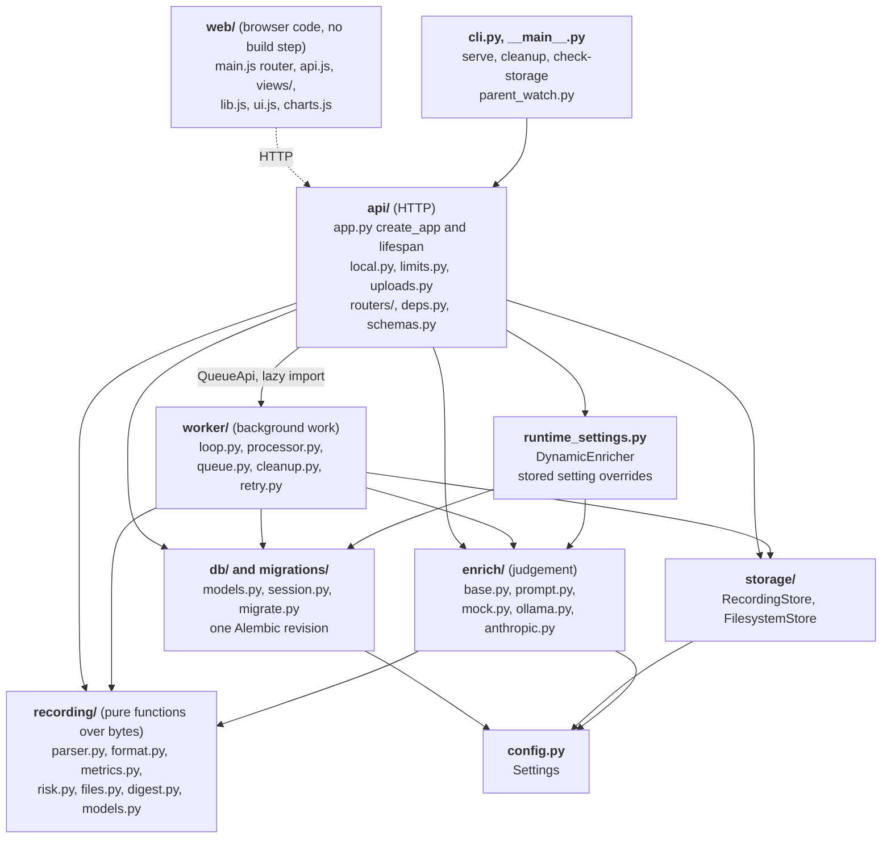
```mermaid
flowchart TB
    ui["<b>web/</b> (browser code, no build step)<br/>main.js router, api.js, views/,<br/>lib.js, ui.js, charts.js"]
    cli["<b>cli.py, __main__.py</b><br/>serve, cleanup, check-storage<br/>parent_watch.py"]
    api["<b>api/</b> (HTTP)<br/>app.py create_app and lifespan<br/>local.py, limits.py, uploads.py<br/>routers/, deps.py, schemas.py"]
    worker["<b>worker/</b> (background work)<br/>loop.py, processor.py,<br/>queue.py, cleanup.py, retry.py"]
    rs["<b>runtime_settings.py</b><br/>DynamicEnricher<br/>stored setting overrides"]
    enrich["<b>enrich/</b> (judgement)<br/>base.py, prompt.py,<br/>mock.py, ollama.py, anthropic.py"]
    recording["<b>recording/</b> (pure functions over bytes)<br/>parser.py, format.py, metrics.py,<br/>risk.py, files.py, digest.py, models.py"]
    db["<b>db/ and migrations/</b><br/>models.py, session.py, migrate.py<br/>one Alembic revision"]
    storage["<b>storage/</b><br/>RecordingStore, FilesystemStore"]
    cfg["<b>config.py</b><br/>Settings"]

    ui -. "HTTP" .-> api
    cli --> api
    api -- "QueueApi, lazy import" --> worker
    api --> recording
    api --> rs
    api --> enrich
    api --> db
    api --> storage
    worker --> recording
    worker --> enrich
    worker --> db
    worker --> storage
    rs --> enrich
    rs --> db
    enrich --> recording
    db --> cfg
    storage --> cfg
    enrich --> cfg
```

The worker never imports `runtime_settings`. It is handed an `Enricher` and does not know it is a `DynamicEnricher`. The `cleanup` command in `cli.py` also reaches into `worker`, `db` and `storage` directly; the arrows above leave that out.

Three rules keep this layering honest:

- `recording/` imports nothing else from the program. It takes bytes and returns an `Analysis`. That makes it the easiest part to test and the part most likely to meet hostile input.
- `enrich/` knows about `recording.models.Analysis` and nothing about the database, the HTTP layer or the worker. An enricher is "analysis in, result out".
- The API reaches the worker's queue code through `deps.QueueApi`, a small interface with an adapter that imports `worker.queue` lazily. The API tests can run against stand-ins, and the API module can be loaded without the worker.

### 2.2 The recording package

`Event` is one parsed line. The envelope fields (`v`, `seq`, `time`, `session`, `pane`, `type`) are strict. Everything else is optional and read loosely, so a line with an unfamiliar shape becomes an event of unknown shape instead of an error.

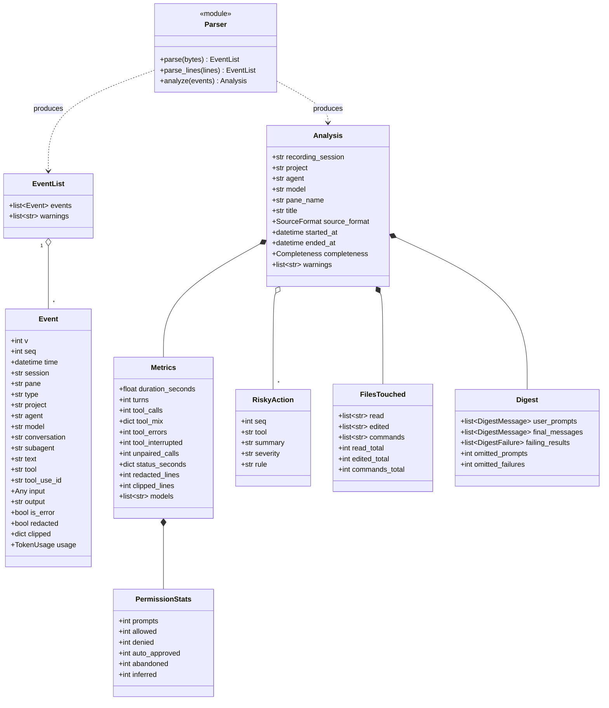
```mermaid
classDiagram
    class Event {
        +int v
        +int seq
        +datetime time
        +str session
        +str pane
        +str type
        +str project
        +str agent
        +str model
        +str conversation
        +str subagent
        +str text
        +str tool
        +str tool_use_id
        +Any input
        +str output
        +bool is_error
        +bool redacted
        +dict clipped
        +TokenUsage usage
    }
    class EventList {
        +list~Event~ events
        +list~str~ warnings
    }
    class Analysis {
        +str recording_session
        +str project
        +str agent
        +str model
        +str pane_name
        +str title
        +SourceFormat source_format
        +datetime started_at
        +datetime ended_at
        +Completeness completeness
        +list~str~ warnings
    }
    class Metrics {
        +float duration_seconds
        +int turns
        +int tool_calls
        +dict tool_mix
        +int tool_errors
        +int tool_interrupted
        +int unpaired_calls
        +dict status_seconds
        +int redacted_lines
        +int clipped_lines
        +list~str~ models
    }
    class PermissionStats {
        +int prompts
        +int allowed
        +int denied
        +int auto_approved
        +int abandoned
        +int inferred
    }
    class RiskyAction {
        +int seq
        +str tool
        +str summary
        +str severity
        +str rule
    }
    class FilesTouched {
        +list~str~ read
        +list~str~ edited
        +list~str~ commands
        +int read_total
        +int edited_total
        +int commands_total
    }
    class Digest {
        +list~DigestMessage~ user_prompts
        +list~DigestMessage~ final_messages
        +list~DigestFailure~ failing_results
        +int omitted_prompts
        +int omitted_failures
    }
    class Parser {
        <<module>>
        +parse(bytes) EventList
        +parse_lines(lines) EventList
        +analyze(events) Analysis
    }
    EventList "1" o-- "*" Event
    Parser ..> EventList : produces
    Parser ..> Analysis : produces
    Analysis *-- Metrics
    Analysis *-- FilesTouched
    Analysis *-- Digest
    Analysis o-- "*" RiskyAction
    Metrics *-- PermissionStats
```

The package raises two errors on purpose: `UnsupportedVersion` for a line whose `v` is not 1, and `EmptyRecording` when no line survives. Everything else it meets (malformed JSON, a cut-off last line, unknown event types, sequence gaps) becomes a warning on the `Analysis`.

### 2.3 Enrichment

An enricher takes an `Analysis` and returns an `EnrichmentResult`. Three implementations exist. The worker and the re-enrich endpoint never hold one directly. They hold a `DynamicEnricher`, which picks the right one from the stored settings before each call.

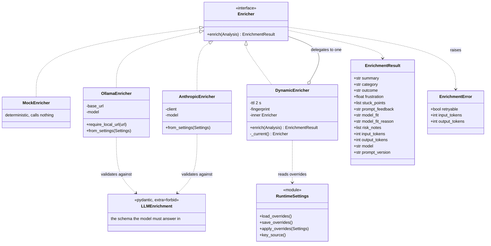
```mermaid
classDiagram
    class Enricher {
        <<interface>>
        +enrich(Analysis) EnrichmentResult
    }
    class MockEnricher {
        deterministic, calls nothing
    }
    class OllamaEnricher {
        -base_url
        -model
        +require_local_url(url)
        +from_settings(Settings)
    }
    class AnthropicEnricher {
        -client
        -model
        +from_settings(Settings)
    }
    class DynamicEnricher {
        -ttl 2 s
        -fingerprint
        -inner Enricher
        +enrich(Analysis) EnrichmentResult
        -_current() Enricher
    }
    class EnrichmentResult {
        +str summary
        +str category
        +str outcome
        +float frustration
        +list stuck_points
        +str prompt_feedback
        +str model_fit
        +str model_fit_reason
        +list risk_notes
        +int input_tokens
        +int output_tokens
        +str model
        +str prompt_version
    }
    class EnrichmentError {
        +bool retryable
        +int input_tokens
        +int output_tokens
    }
    class LLMEnrichment {
        <<pydantic, extra=forbid>>
        the schema the model must answer in
    }
    class RuntimeSettings {
        <<module>>
        +load_overrides()
        +save_overrides()
        +apply_overrides(Settings)
        +key_source()
    }
    Enricher <|.. MockEnricher
    Enricher <|.. OllamaEnricher
    Enricher <|.. AnthropicEnricher
    Enricher <|.. DynamicEnricher
    DynamicEnricher o-- Enricher : delegates to one
    DynamicEnricher ..> RuntimeSettings : reads overrides
    Enricher ..> EnrichmentResult
    Enricher ..> EnrichmentError : raises
    OllamaEnricher ..> LLMEnrichment : validates against
    AnthropicEnricher ..> LLMEnrichment : validates against
```

Both model-backed enrichers follow the same procedure. They build one user message from the `Analysis`: the computed facts and a bounded digest, each as JSON inside `<facts>` and `<digest>` tags that the system prompt says are data, not instructions. They ask for output that matches the `LLMEnrichment` JSON schema. They validate the reply and ask again, up to three attempts, if it does not validate. If the model stops because it ran out of output tokens, they retry once with double the room, then give up. Afterwards they drop anything the model invented: a stuck point's event number or a risk note's number that was not in the prompt is removed or nulled.

`EnrichmentError.retryable` is how an enricher tells the worker whether trying again could help. Rate limits, connection errors, timeouts and 5xx answers are retryable. A refusal, a 400 or 401, or output that never validates is not.

### 2.4 Storage and persistence

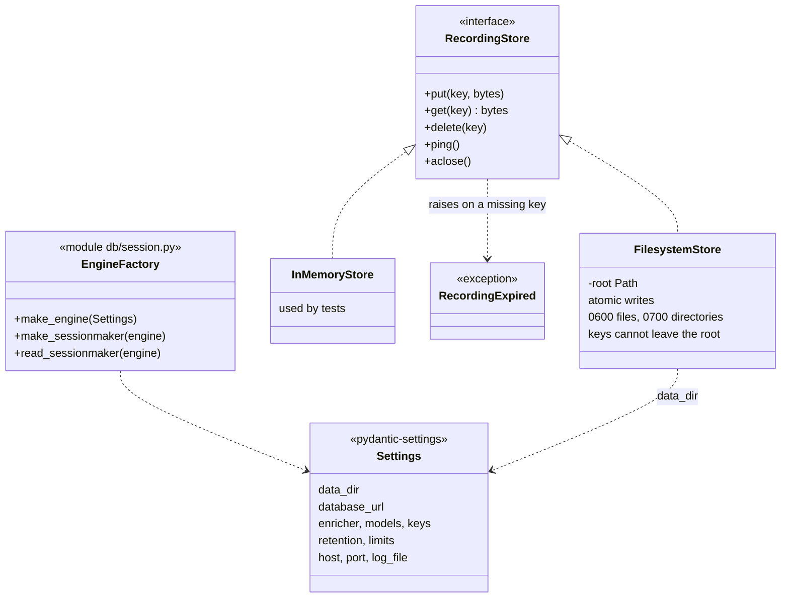
```mermaid
classDiagram
    class RecordingStore {
        <<interface>>
        +put(key, bytes)
        +get(key) bytes
        +delete(key)
        +ping()
        +aclose()
    }
    class FilesystemStore {
        -root Path
        atomic writes
        0600 files, 0700 directories
        keys cannot leave the root
    }
    class InMemoryStore {
        used by tests
    }
    class RecordingExpired {
        <<exception>>
    }
    class Settings {
        <<pydantic-settings>>
        data_dir
        database_url
        enricher, models, keys
        retention, limits
        host, port, log_file
    }
    class EngineFactory {
        <<module db/session.py>>
        +make_engine(Settings)
        +make_sessionmaker(engine)
        +read_sessionmaker(engine)
    }
    RecordingStore <|.. FilesystemStore
    RecordingStore <|.. InMemoryStore
    RecordingStore ..> RecordingExpired : raises on a missing key
    EngineFactory ..> Settings
    FilesystemStore ..> Settings : data_dir
```

`make_engine` is the only place a SQLite engine is built. It turns on WAL mode, enables foreign keys, sets a 30 second busy timeout, and makes ordinary transactions start with `BEGIN IMMEDIATE`. `read_sessionmaker` returns sessions that start with a plain `BEGIN` instead. Section 7 explains why both exist.

### 2.5 The HTTP layer

Requests pass through the layers below in this order. `LocalOnly` is added last in `create_app`, which makes it the outermost.

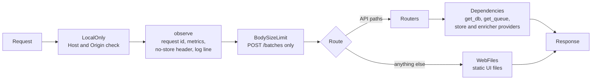
```mermaid
flowchart LR
    req[Request] --> lo[LocalOnly<br/>Host and Origin check]
    lo --> obs[observe<br/>request id, metrics,<br/>no-store header, log line]
    obs --> bsl[BodySizeLimit<br/>POST /batches only]
    bsl --> route{Route}
    route -->|API paths| r[Routers]
    route -->|anything else| st[WebFiles<br/>static UI files]
    r --> dep[Dependencies<br/>get_db, get_queue,<br/>store and enricher providers]
    dep --> resp[Response]
    st --> resp
```

The store and the enricher are created lazily by providers (`get_store_provider`, `get_enricher_provider`). If one cannot be built, the handler that needs it answers 503 and logs the exception type, and the rest of the API keeps working. `get_db` hands out a deferred (read) session for GET and HEAD requests and a write session for everything else.

The endpoints:

| Method and path | Purpose |
|---|---|
| `POST /batches` | Upload one or more `.jsonl` files. Answers 202 with the batch id and the accepted and rejected names, or 422 if nothing was acceptable. |
| `GET /batches/{id}` | Batch status with a count of items per status, and each item's status and error. |
| `POST /batches/{id}/retry` | Re-queue the failed items. |
| `POST /batches/{id}/cancel` | Cancel the queued items. Running items finish. |
| `GET /sessions` | Filter, sort and page the sessions. |
| `GET /sessions/{id}` | Metrics, risky actions, files touched, warnings and the enrichment. |
| `GET /sessions/{id}/events` | Raw events, paged by `after_seq`. 410 if the raw file has expired. |
| `POST /sessions/{id}/enrich` | Run enrichment again now and overwrite the stored result. |
| `DELETE /sessions/{id}` | Delete the session, its enrichment and its raw files. |
| `GET /stats/trends`, `/stats/compare`, `/stats/usage` | Aggregates over sessions. |
| `GET /config`, `GET` and `PUT /settings` | Non-secret runtime facts, and the enrichment settings. |
| `GET /healthz`, `/readyz`, `/metrics` | Liveness, readiness (database and store), Prometheus text. |

## 3. Process structure at run time

One process, one event loop, four kinds of long-lived activity.

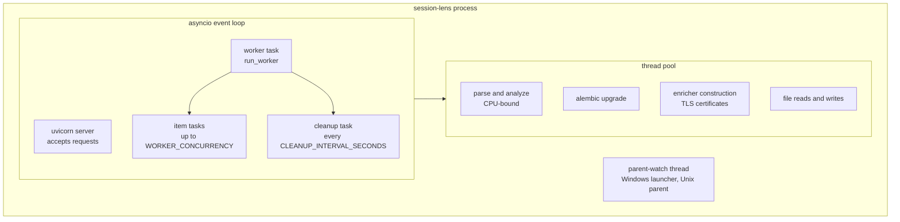
```mermaid
flowchart TB
    subgraph proc[session-lens process]
        subgraph loop[asyncio event loop]
            uv[uvicorn server<br/>accepts requests]
            wk[worker task<br/>run_worker]
            sub1[item tasks<br/>up to WORKER_CONCURRENCY]
            cl[cleanup task<br/>every CLEANUP_INTERVAL_SECONDS]
            wk --> sub1
            wk --> cl
        end
        subgraph threads[thread pool]
            t1[parse and analyze<br/>CPU-bound]
            t2[alembic upgrade]
            t3[enricher construction<br/>TLS certificates]
            t4[file reads and writes]
        end
        pw[parent-watch thread<br/>Windows launcher, Unix parent]
        loop --> threads
    end
```

Work that can take long or block goes to a thread: parsing a 16 MiB file, the migration, building an HTTP client (loading TLS certificates took seconds on one test machine and froze the whole UI while it ran on the loop), and file access. A request that is waiting on the model holds no database connection.

## 4. Data model

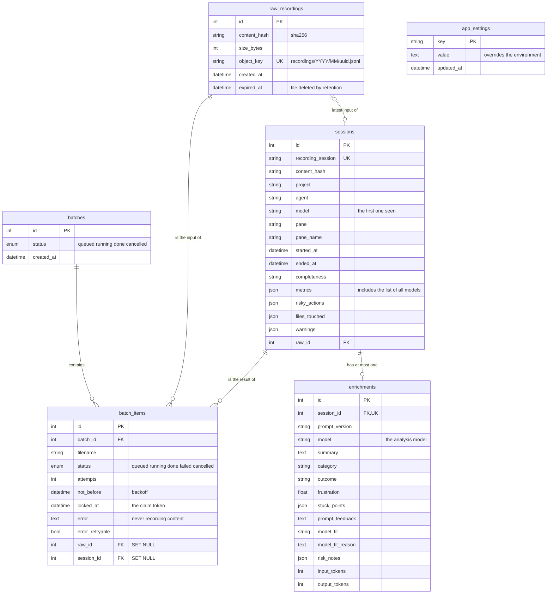
```mermaid
erDiagram
    batches ||--o{ batch_items : contains
    raw_recordings ||--o{ batch_items : "is the input of"
    sessions ||--o{ batch_items : "is the result of"
    raw_recordings |o--o| sessions : "latest input of"
    sessions ||--o| enrichments : "has at most one"

    batches {
        int id PK
        enum status "queued running done cancelled"
        datetime created_at
    }
    batch_items {
        int id PK
        int batch_id FK
        string filename
        enum status "queued running done failed cancelled"
        int attempts
        datetime not_before "backoff"
        datetime locked_at "the claim token"
        text error "never recording content"
        bool error_retryable
        int raw_id FK "SET NULL"
        int session_id FK "SET NULL"
    }
    raw_recordings {
        int id PK
        string content_hash "sha256"
        int size_bytes
        string object_key UK "recordings/YYYY/MM/uuid.jsonl"
        datetime created_at
        datetime expired_at "file deleted by retention"
    }
    sessions {
        int id PK
        string recording_session UK
        string content_hash
        string project
        string agent
        string model "the first one seen"
        string pane
        string pane_name
        datetime started_at
        datetime ended_at
        string completeness
        json metrics "includes the list of all models"
        json risky_actions
        json files_touched
        json warnings
        int raw_id FK
    }
    enrichments {
        int id PK
        int session_id FK,UK
        string prompt_version
        string model "the analysis model"
        text summary
        string category
        string outcome
        float frustration
        json stuck_points
        text prompt_feedback
        string model_fit
        text model_fit_reason
        json risk_notes
        int input_tokens
        int output_tokens
    }
    app_settings {
        string key PK
        text value "overrides the environment"
        datetime updated_at
    }
```

Some choices in this model are worth knowing before reading the flows:

- A session is identified by its `recording_session` string, not by the upload. Uploading the same session twice, or a longer copy of it, updates one row. `content_hash` decides whether anything changed.
- A `batch_item` is the unit of work. Its `locked_at` value is a claim token: only the claimer whose token still matches may finish the item.
- Foreign keys from items to raw files and sessions are `SET NULL`, so deleting a raw file or a session never deletes batch history. The enrichment and the batch-to-item links cascade.
- `app_settings` is a key-value table with no relations. The Anthropic key is a row in it, stored in plain text, and is never returned by the API.
- `metrics` is a JSON column read by the statistics queries through SQLAlchemy's JSON path operators.

### 4.1 Item and batch lifecycles

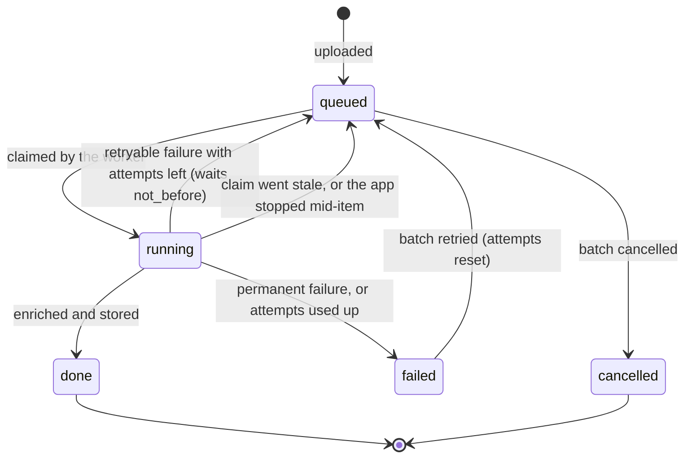
```mermaid
stateDiagram-v2
    [*] --> queued : uploaded
    queued --> running : claimed by the worker
    running --> done : enriched and stored
    running --> queued : retryable failure with attempts left (waits not_before)
    running --> queued : claim went stale, or the app stopped mid-item
    running --> failed : permanent failure, or attempts used up
    queued --> cancelled : batch cancelled
    failed --> queued : batch retried (attempts reset)
    done --> [*]
    cancelled --> [*]
```

A claim is stale after `CLAIM_TIMEOUT_SECONDS` (300). An item that is released because the app is shutting down gets its attempt refunded. An item that is recovered as stale keeps the attempt it used, so something that keeps killing the program eventually fails instead of looping forever.

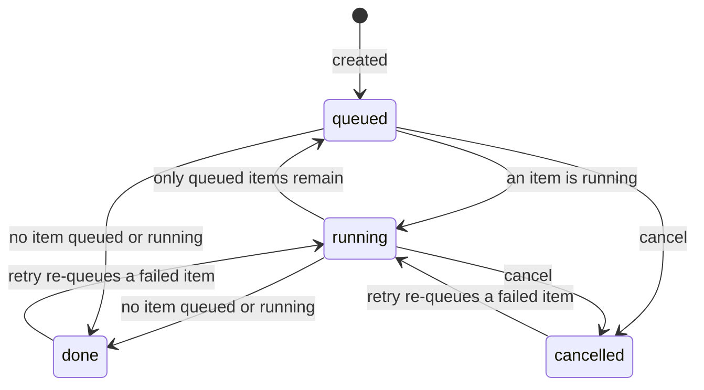
```mermaid
stateDiagram-v2
    [*] --> queued : created
    queued --> running : an item is running
    running --> queued : only queued items remain
    running --> done : no item queued or running
    queued --> done : no item queued or running
    queued --> cancelled : cancel
    running --> cancelled : cancel
    cancelled --> running : retry re-queues a failed item
    done --> running : retry re-queues a failed item
```

The batch status is recomputed from its items each time an item changes (`refresh_batch_status`). `cancelled` is the exception: it stays until a retry clears it.

## 5. Flows

### 5.1 Start-up and shutdown

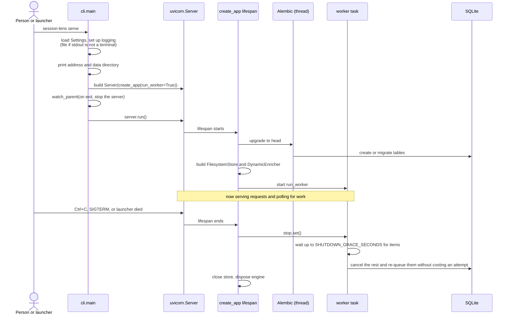
```mermaid
sequenceDiagram
    actor P as Person or launcher
    participant C as cli.main
    participant S as uvicorn.Server
    participant A as create_app lifespan
    participant M as Alembic (thread)
    participant W as worker task
    participant D as SQLite

    P->>C: session-lens serve
    C->>C: load Settings, set up logging<br/>(file if stdout is not a terminal)
    C->>C: print address and data directory
    C->>S: build Server(create_app(run_worker=True))
    C->>C: watch_parent(on exit, stop the server)
    C->>S: server.run()
    S->>A: lifespan starts
    A->>M: upgrade to head
    M->>D: create or migrate tables
    A->>A: build FilesystemStore and DynamicEnricher
    A->>W: start run_worker
    Note over S,W: now serving requests and polling for work
    P->>S: Ctrl+C, SIGTERM, or launcher died
    S->>A: lifespan ends
    A->>W: stop.set()
    W->>W: wait up to SHUTDOWN_GRACE_SECONDS for items
    W->>D: cancel the rest and re-queue them without costing an attempt
    A->>A: close store, dispose engine
```

The database is migrated on every start, so there is no install or upgrade step. If the data folder does not exist, the engine creates it.

### 5.2 Uploading recordings

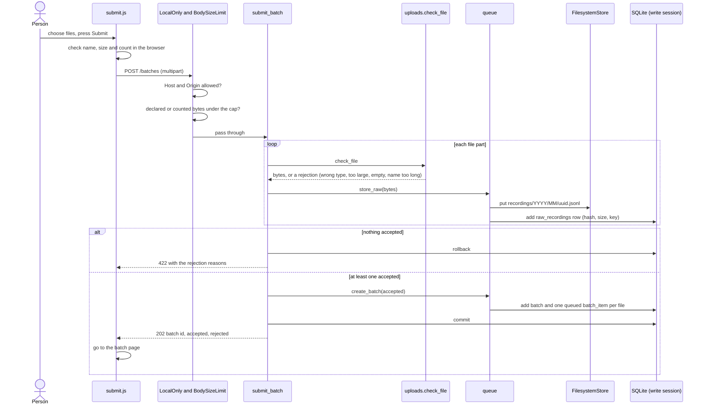
```mermaid
sequenceDiagram
    actor P as Person
    participant UI as submit.js
    participant G as LocalOnly and BodySizeLimit
    participant H as submit_batch
    participant U as uploads.check_file
    participant Q as queue
    participant F as FilesystemStore
    participant D as SQLite (write session)

    P->>UI: choose files, press Submit
    UI->>UI: check name, size and count in the browser
    UI->>G: POST /batches (multipart)
    G->>G: Host and Origin allowed?
    G->>G: declared or counted bytes under the cap?
    G->>H: pass through
    loop each file part
        H->>U: check_file
        U-->>H: bytes, or a rejection (wrong type, too large, empty, name too long)
        H->>Q: store_raw(bytes)
        Q->>F: put recordings/YYYY/MM/uuid.jsonl
        Q->>D: add raw_recordings row (hash, size, key)
    end
    alt nothing accepted
        H->>D: rollback
        H-->>UI: 422 with the rejection reasons
    else at least one accepted
        H->>Q: create_batch(accepted)
        Q->>D: add batch and one queued batch_item per file
        H->>D: commit
        H-->>UI: 202 batch id, accepted, rejected
        UI->>UI: go to the batch page
    end
```

The file is written before its row, so a row never points at a missing file. If the transaction then fails, the file stays on disk with no row. That is harmless and invisible. Only one uploaded file is held in memory at a time. Nothing is parsed here: parsing is the worker's job, so an upload of a file with a bad format still succeeds and then fails on the batch page with a reason.

### 5.3 The worker loop

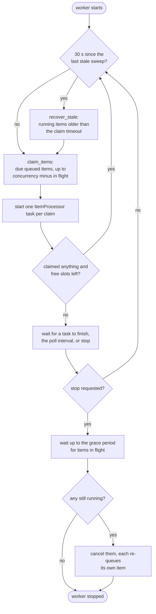
```mermaid
flowchart TB
    start([worker starts]) --> sweep{30 s since the<br/>last stale sweep?}
    sweep -- yes --> rec[recover_stale:<br/>running items older than<br/>the claim timeout]
    sweep -- no --> claim
    rec --> claim[claim_items:<br/>due queued items, up to<br/>concurrency minus in flight]
    claim --> spawn[start one ItemProcessor task per claim]
    spawn --> more{claimed anything and<br/>free slots left?}
    more -- yes --> sweep
    more -- no --> wait[wait for a task to finish,<br/>the poll interval, or stop]
    wait --> stop{stop requested?}
    stop -- no --> sweep
    stop -- yes --> drain[wait up to the grace period<br/>for items in flight]
    drain --> late{any still running?}
    late -- yes --> cancel[cancel them, each re-queues<br/>its own item]
    late -- no --> end1
    cancel --> end1([worker stopped])
```

`claim_items` is one write transaction. It selects the due queued items (status `queued`, and `not_before` empty or in the past) in id order, sets them to `running`, stamps `locked_at` with the current time, adds one to `attempts`, and recomputes the batch status. The write lock held for the whole transaction is what stops two claimers from taking the same row. The attempt is counted at claim time, not at failure time, so an item that crashes the process still consumes attempts.

The cleanup task runs next to this loop. It is started once, runs immediately, then sleeps for `CLEANUP_INTERVAL_SECONDS` (3600) between runs, and is cancelled at shutdown. Setting the interval to 0 turns it off.

### 5.4 Processing one item

This is the centre of the program. An item goes through two phases, and no database connection is held during the slow part.

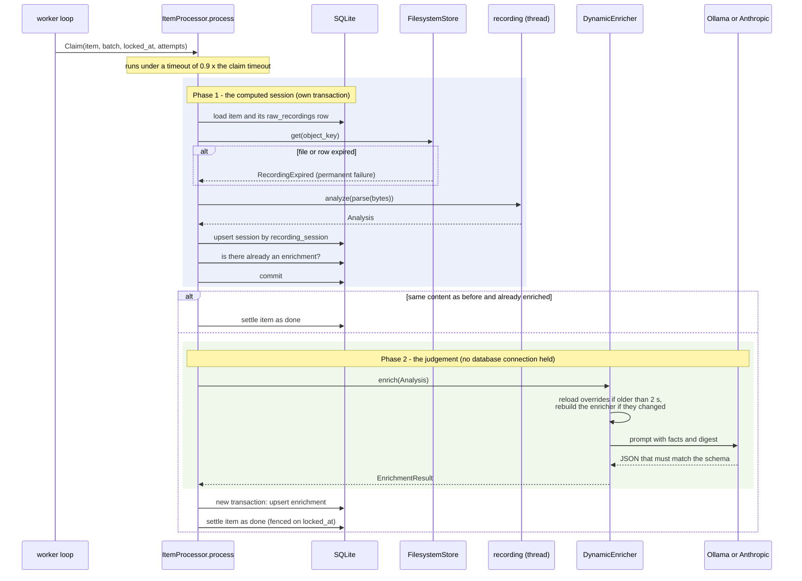
```mermaid
sequenceDiagram
    participant W as worker loop
    participant P as ItemProcessor.process
    participant D as SQLite
    participant F as FilesystemStore
    participant R as recording (thread)
    participant E as DynamicEnricher
    participant X as Ollama or Anthropic

    W->>P: Claim(item, batch, locked_at, attempts)
    Note over P: runs under a timeout of 0.9 x the claim timeout
    rect rgb(235, 240, 250)
    Note over P,D: Phase 1 - the computed session (own transaction)
    P->>D: load item and its raw_recordings row
    P->>F: get(object_key)
    alt file or row expired
        F-->>P: RecordingExpired (permanent failure)
    end
    P->>R: analyze(parse(bytes))
    R-->>P: Analysis
    P->>D: upsert session by recording_session
    P->>D: is there already an enrichment?
    P->>D: commit
    end
    alt same content as before and already enriched
        P->>D: settle item as done
    else
        rect rgb(240, 248, 235)
        Note over P,X: Phase 2 - the judgement (no database connection held)
        P->>E: enrich(Analysis)
        E->>E: reload overrides if older than 2 s,<br/>rebuild the enricher if they changed
        E->>X: prompt with facts and digest
        X-->>E: JSON that must match the schema
        E-->>P: EnrichmentResult
        end
        P->>D: new transaction: upsert enrichment
        P->>D: settle item as done (fenced on locked_at)
    end
```

Phase 1 is done and committed before the model is called. If the model is slow, rate limited or down, the person still has a session with metrics, risky actions and files touched. Only the enrichment is missing, and the item retries later.

Settling an item is an `UPDATE ... WHERE id = ? AND status = 'running' AND locked_at = <my token>`. If the claim was taken over after going stale, the update matches no row, the processor logs "claim lost", and its result is dropped. This is the fencing check. It cannot fire often in a single process, but the same code handles a task that overran its timeout.

### 5.5 Failures and retries

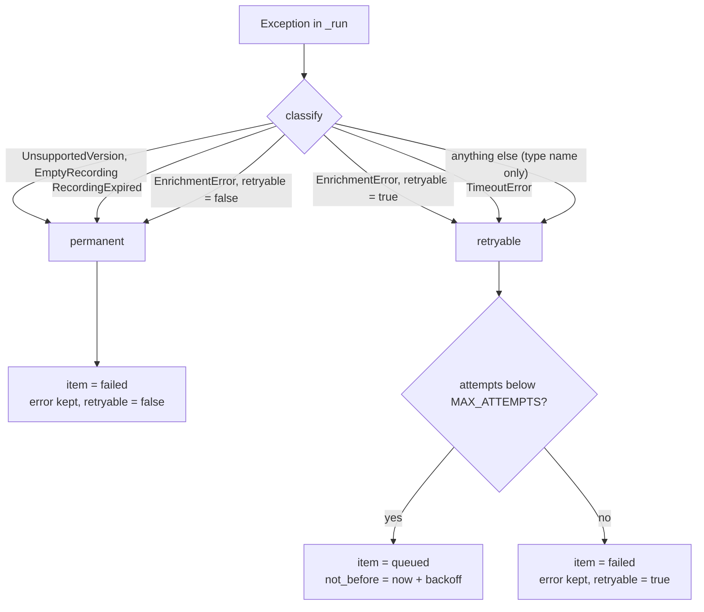
```mermaid
flowchart TB
    exc[Exception in _run] --> cls{classify}
    cls -- "UnsupportedVersion, EmptyRecording" --> perm
    cls -- RecordingExpired --> perm
    cls -- "EnrichmentError, retryable = false" --> perm
    cls -- "EnrichmentError, retryable = true" --> retr
    cls -- TimeoutError --> retr
    cls -- "anything else (type name only)" --> retr
    perm[permanent] --> failed[item = failed<br/>error kept, retryable = false]
    retr[retryable] --> left{attempts below MAX_ATTEMPTS?}
    left -- yes --> requeue["item = queued<br/>not_before = now + backoff"]
    left -- no --> failed2[item = failed<br/>error kept, retryable = true]
```

Backoff is exponential with equal jitter: 5 s doubled for each attempt, capped at 300 s, and half of the delay is random so a burst of failures does not retry in lockstep. `MAX_ATTEMPTS` is 4. Error text stored on an item is never recording content. For exception types the program does not control, only the type name is kept, because a validation error can echo its input.

A person can press Retry on a batch, which resets failed items to queued with zero attempts. Cancel moves queued items to cancelled and leaves running ones alone.

### 5.6 Watching progress

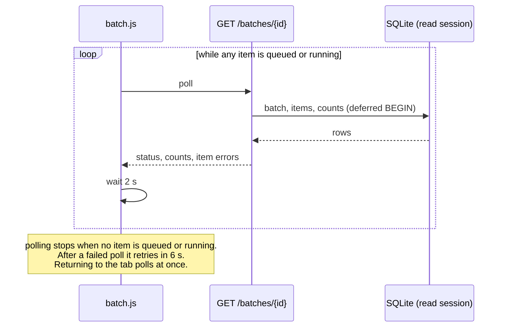
```mermaid
sequenceDiagram
    participant UI as batch.js
    participant API as GET /batches/{id}
    participant D as SQLite (read session)

    loop while any item is queued or running
        UI->>API: poll
        API->>D: batch, items, counts (deferred BEGIN)
        D-->>API: rows
        API-->>UI: status, counts, item errors
        UI->>UI: wait 2 s
    end
    Note over UI: polling stops when no item is queued or running.<br/>After a failed poll it retries in 6 s.<br/>Returning to the tab polls at once.
```

Each finished item links to its session.

Reads use a session that does not take the write lock, so polling never delays the worker and the worker never delays the page.

### 5.7 Reading a session and its raw events

`GET /sessions/{id}` returns what is in the database: the computed fields and the enrichment. It touches no file.

`GET /sessions/{id}/events` is different. It looks up the raw file's key, releases its database transaction, reads the file from the store, parses it in a thread and returns the requested page of events. If the row is marked expired, or the file is gone, the answer is 410 and the page shows that raw data was removed. When it finds the file missing it records `expired_at`, so later requests answer 410 without touching the disk.

### 5.8 Re-enriching a session

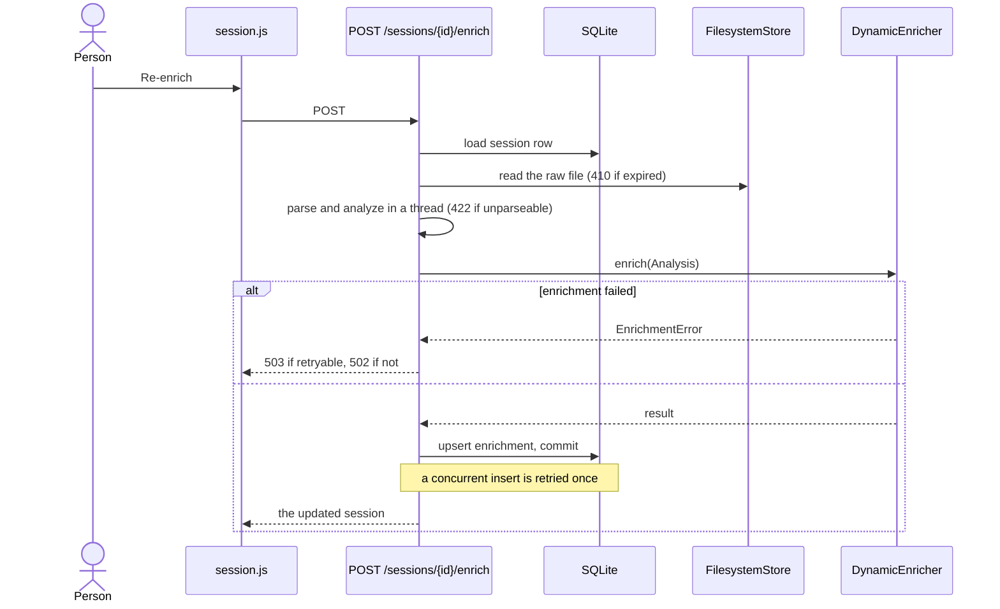
```mermaid
sequenceDiagram
    actor P as Person
    participant UI as session.js
    participant API as POST /sessions/{id}/enrich
    participant D as SQLite
    participant F as FilesystemStore
    participant E as DynamicEnricher

    P->>UI: Re-enrich
    UI->>API: POST
    API->>D: load session row
    API->>F: read the raw file (410 if expired)
    API->>API: parse and analyze in a thread (422 if unparseable)
    API->>E: enrich(Analysis)
    alt enrichment failed
        E-->>API: EnrichmentError
        API-->>UI: 503 if retryable, 502 if not
    else
        E-->>API: result
        API->>D: upsert enrichment, commit
        Note over API,D: a concurrent insert is retried once
        API-->>UI: the updated session
    end
```

This path runs the same analysis and the same enrichers as the worker, but synchronously in the request, and it overwrites the stored enrichment. The `prompt_version` and `model` on the row say what produced it.

### 5.9 Changing settings

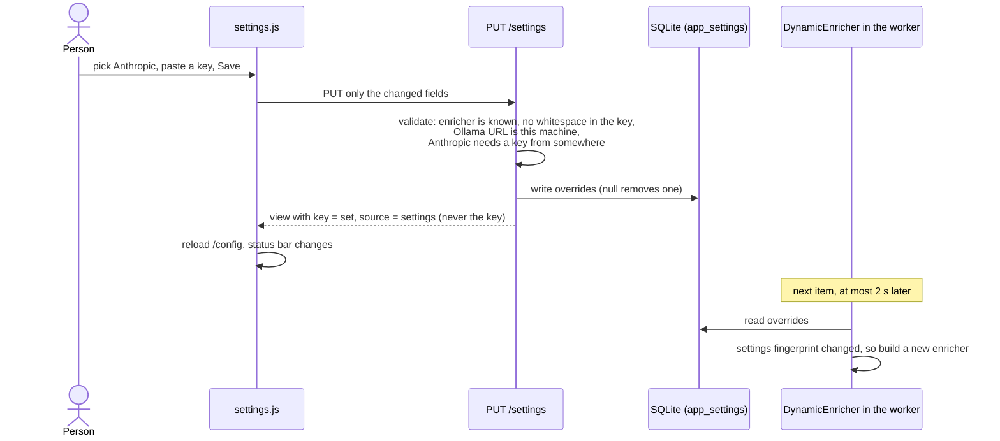
```mermaid
sequenceDiagram
    actor P as Person
    participant UI as settings.js
    participant API as PUT /settings
    participant D as SQLite (app_settings)
    participant E as DynamicEnricher in the worker

    P->>UI: pick Anthropic, paste a key, Save
    UI->>API: PUT only the changed fields
    API->>API: validate: enricher is known, no whitespace in the key,<br/>Ollama URL is this machine,<br/>Anthropic needs a key from somewhere
    API->>D: write overrides (null removes one)
    API-->>UI: view with key = set, source = settings (never the key)
    UI->>UI: reload /config, status bar changes
    Note over E: next item, at most 2 s later
    E->>D: read overrides
    E->>E: settings fingerprint changed, so build a new enricher
```

Settings stored here override the environment. Removing an override puts the environment's value back. A request that would leave Anthropic selected with no key is refused with 422 before anything is written. If a bad value reaches the database anyway (for instance a non-local Ollama URL), `DynamicEnricher` builds nothing, and each item that needs it fails as non-retryable with a message that names the setting. Fixing the setting and pressing Retry works without a restart.

### 5.10 Retention and deletion

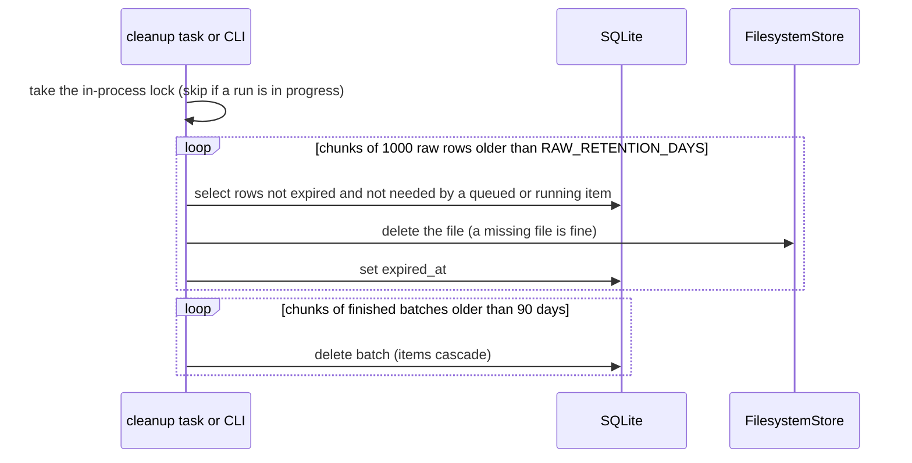
```mermaid
sequenceDiagram
    participant T as cleanup task or CLI
    participant D as SQLite
    participant F as FilesystemStore

    T->>T: take the in-process lock (skip if a run is in progress)
    loop chunks of 1000 raw rows older than RAW_RETENTION_DAYS
        T->>D: select rows not expired and not needed by a queued or running item
        T->>F: delete the file (a missing file is fine)
        T->>D: set expired_at
    end
    loop chunks of finished batches older than 90 days
        T->>D: delete batch (items cascade)
    end
```

Retention removes raw files only. Sessions, metrics and enrichments are derived data and stay. Setting `RAW_RETENTION_DAYS` to 0 keeps raw files until they are deleted by hand.

`DELETE /sessions/{id}` is the manual version: it finds every raw file linked to the session (its own and those of the batch items that produced it), deletes the files, deletes their rows, then deletes the session. The enrichment goes with it by cascade.

## 6. Parsing and analysis

`analyze(parse(bytes))` is a pure function. Its steps:

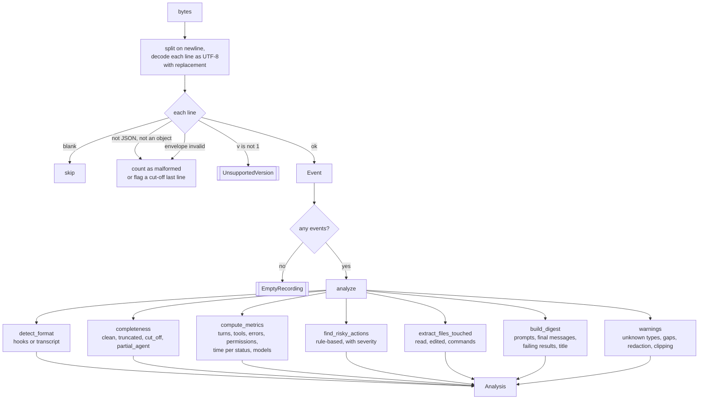
```mermaid
flowchart TB
    bytes[bytes] --> split[split on newline,<br/>decode each line as UTF-8<br/>with replacement]
    split --> line{each line}
    line -- blank --> skip1[skip]
    line -- "not JSON, not an object" --> bad[count as malformed<br/>or flag a cut-off last line]
    line -- "v is not 1" --> unsup[[UnsupportedVersion]]
    line -- "envelope invalid" --> bad
    line -- ok --> ev[Event]
    ev --> any{any events?}
    any -- no --> empty[[EmptyRecording]]
    any -- yes --> an[analyze]
    an --> f[detect_format<br/>hooks or transcript]
    an --> c[completeness<br/>clean, truncated, cut_off, partial_agent]
    an --> m[compute_metrics<br/>turns, tools, errors, permissions,<br/>time per status, models]
    an --> r[find_risky_actions<br/>rule-based, with severity]
    an --> t[extract_files_touched<br/>read, edited, commands]
    an --> d[build_digest<br/>prompts, final messages,<br/>failing results, title]
    an --> w[warnings<br/>unknown types, gaps, redaction, clipping]
    f & c & m & r & t & d & w --> out[Analysis]
```

Flockdeck has written two kinds of recording file, and both are version 1. A hook-written file (0.3.47) has permission and status events. A transcript, built from the agent's own stored conversation, does not, and may have `conversation_title` lines. `detect_format` tells them apart from the first line's text. Metrics that depend on events a file does not have come out empty, and the UI says "None recorded" rather than showing zeros.

The digest is the only part of a recording that can reach a model. It holds the person's prompts, the agent's final messages and trimmed failing tool output, and each is clipped to a fixed number of characters and items. A very long session therefore costs about as much to enrich as a short one.

## 7. Concurrency and the database

SQLite allows many readers and one writer at a time. The program uses that deliberately.

| Session kind | Starts with | Used by | Effect |
|---|---|---|---|
| Write | `BEGIN IMMEDIATE` | Worker, POST, PUT, DELETE handlers | Takes the write lock at once. Other writers wait up to 30 s in line instead of failing. |
| Read | `BEGIN` (deferred) | GET and HEAD handlers | Never takes the write lock. In WAL mode it reads a consistent snapshot while a write is in progress. |

A deferred transaction that reads and then writes can fail immediately with "database is locked" if another writer commits in between, whatever the timeout. Taking the lock first avoids that class of error. The cost is that a write transaction must be short, which is why the slow work (parsing, the model call) happens outside transactions.

Within one process the write lock replaces the row locks and advisory locks an earlier MySQL version used. Cleanup uses an `asyncio.Lock` to skip a run that overlaps another.

A test pins the behaviour that matters: 25 concurrent read-then-write transactions on one row lose no update, a reader never waits for a writer, and a writer never waits for a reader.

## 8. Cross-cutting concerns

### 8.1 Local only

There is no API key. Two checks stand in for it, both in `LocalOnly`:

```mermaid
flowchart TB
    r[Request] --> h{Host in ALLOWED_HOSTS?<br/>127.0.0.1, localhost, ::1}
    h -- no --> e421[421 host not allowed<br/>stops DNS rebinding]
    h -- yes --> w{POST, PUT, PATCH or DELETE?}
    w -- no --> ok[continue]
    w -- yes --> o{Origin foreign, null,<br/>or Sec-Fetch-Site cross-site?}
    o -- yes --> e403[403 cross-origin request refused]
    o -- no --> ok
```

A page on another site can send a form post to `127.0.0.1`, and a hostname it controls can be pointed at the local address. The Host check stops the second, and the Origin check stops the first. `curl` and scripts send neither header and are unaffected. No response carries CORS headers, so another origin cannot read a response either. The server binds `127.0.0.1` by default and logs a warning if asked to bind elsewhere. The refusal log line carries no host or origin value, since the caller chose it.

### 8.2 What can leave the machine

With the mock or Ollama enricher, nothing. Ollama's URL must be loopback; the check runs when the enricher is built, the HTTP client ignores proxy variables and does not follow redirects. With Anthropic selected, each session's digest goes to `api.anthropic.com`, the startup log says so, and the status bar reads "Sends digests to Anthropic". The key is a `SecretStr` in memory, a plain row in `app_settings` if set through the UI, and is never returned or logged. The SQLite driver's own debug logging, which prints statement parameters, is pinned to WARNING for that reason.

### 8.3 Logging

Logs are JSON lines holding ids, counts and timings, never recording content, file names or query strings. In a terminal they go to the terminal. When standard output is not a terminal (another program launched the server) they go to `session-lens.log` in the data folder, rotated at 5 MB with three backups, so a pipe nobody reads cannot freeze the server.

### 8.4 Packaging and process control

```mermaid
flowchart LR
    src[source and tests] --> pyi[PyInstaller<br/>packaging/session-lens.spec]
    pyi --> exe["session-lens(.exe)<br/>one file, about 25 MB:<br/>Python, dependencies,<br/>web UI files, migration"]
    exe --> smoke[packaging/smoke.py<br/>starts it, uses it over HTTP]
    smoke --> arch[session-lens_VERSION_OS_ARCH<br/>.tar.gz or .zip]
    arch --> rel[GitHub release draft<br/>with checksums.txt]
```

A one-file executable is a launcher that unpacks itself and runs the real program as a child. If something kills the launcher outright, the child is not told. `parent_watch` runs in the child, notices that its parent process (the same program) is gone and asks the server to shut down normally. It does nothing when the parent is a shell or another program, so running the server from a script that exits early is unaffected.

The smoke test runs the built executable the way a person would: upload a recording, wait for the analysis, read it back, restart and check nothing was lost, select the Anthropic enricher aimed at a dead local port (this proves the SDK is inside the executable, and nothing is sent), and kill the launcher to check the server goes too. It runs per platform in CI.

## 9. Where to look in the code

| Question | Start here |
|---|---|
| What happens when the program starts? | `cli.py`, `api/app.py` (`create_app`, `lifespan`) |
| How is a file turned into metrics? | `recording/parser.py`, then `metrics.py`, `risk.py`, `digest.py` |
| How is an item claimed, run and retried? | `worker/loop.py`, `worker/processor.py`, `worker/retry.py` |
| What does the model see and return? | `enrich/prompt.py`, `enrich/anthropic.py` |
| How do settings change without a restart? | `runtime_settings.py`, `api/routers/settings.py` |
| Why does the UI never wait on the worker? | `db/session.py`, `api/deps.py` (`get_db`) |
| What guards the local API? | `api/local.py`, `api/limits.py`, `api/uploads.py` |
| What are the tables? | `db/models.py`, `migrations/versions/0001_initial_schema.py` |
| How is the executable built and checked? | `packaging/session-lens.spec`, `packaging/smoke.py`, `.github/workflows/release.yaml` |

## 10. Known gaps in this design

- The Anthropic key is stored unencrypted in the SQLite file. Anyone who can read the data folder can read it.
- Retention deletes raw files but keeps the digest-derived fields (summaries, stuck points, prompt feedback) forever. Those can quote the recording.
- There is one writer. A very large batch of long sessions is limited by the enricher, not the database, but a slow disk would show up as write-lock waits.
- Only the Windows x64 executable has been built and run. The other five targets are built by the release workflow, which has not run yet.
- A comment in `worker/queue.py` still describes a lock ordering that mattered under MySQL. It is harmless under SQLite.
